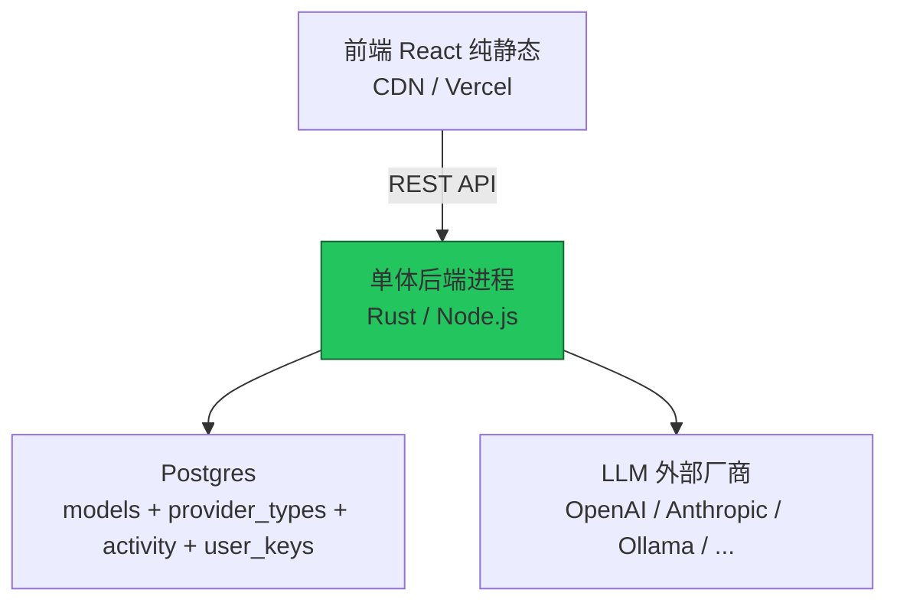

**OpenHub 高内聚方案设计文档 v1.0**  
（Hub + Gateway 合并成单体后端 + 前端纯静态）

**文档目的**：  
供 Gemini 直接开始开发使用。目标是**简化开发、配置实时生效、部署极简**，适用于 MVP / 低流量 / 内部测试阶段。未来流量增长时可无缝拆回 Control/Data Plane 分离架构。

### 1. 架构决策（核心原则）

- **后端**：**单体进程**（推荐 Rust 单 binary，也可 Node.js）。Hub 控制面（模型管理、密钥、Dashboard API） + Gateway 数据面（LLM 路由、协议仿真、负载均衡、计费、adapter/drivers）**全部合并到一个进程**。
- **前端**：纯 React + Vite 静态构建（dist 文件夹），独立部署到 CDN / Nginx / Vercel / S3，与后端零耦合。
- **配置变更**：直接内存生效（零延迟、无轮询、无 Push）。
- **通信**：前端 ↔ 后端仅 REST API；后端内部直接函数调用（高内聚）。
- **数据库**：仍用 Postgres（单实例即可）。
- **适用场景**：开发便利 > 高并发。生产上线前若 QPS > 500 可拆回分离架构。

**架构图**（Mermaid）：


### 2. 项目目录结构（最终形态）

```
openhub/
├── backend/                  # 单体后端（推荐 Rust）
│   ├── src/
│   │   ├── main.rs           # 入口（Axum server）
│   │   ├── config/           # 模型、provider、pricing 配置（内存 + DB）
│   │   ├── adapter/          # 驱动（openai/anthopic/ollama）
│   │   ├── router/           # LLM 路由 + 协议仿真（/v1/chat/completions 等）
│   │   ├── pool/             # 负载均衡、rate-limiter
│   │   ├── engine/           # 实例管理 + 计费（Quota）
│   │   ├── endpoints/        # 合并后的 API（admin + gateway + emulators）
│   │   ├── db/               # Diesel schema + pool
│   │   └── lib.rs
│   ├── Cargo.toml
│   └── .env.example
├── frontend/                 # 原 hub/ 目录，纯静态
│   ├── src/                  # React 组件（Models/Keys/Chat 等）
│   ├── vite.config.ts        # build.outDir: '../dist'
│   └── package.json
├── docker-compose.yml        # 单容器部署
├── Dockerfile                # Rust 单 binary
└── README.md
```

### 3. 后端详细设计（Rust 单体推荐）

**技术栈**：Rust + Axum + Diesel + tokio + tiktoken-rs（保持原 GW 高性能）。

**关键模块合并方式**：
- 原 `hub/server.ts` 的 `/api/models`、`/api/provider-keys`、`/api/activity` 等控制面 API 全部保留。
- 原 GW 的 `endpoints/emulators/*`、`adapter/drivers/*`、`router/llm.rs`、`pool/*` 直接移动到后端对应目录。
- 配置管理：内存 HashMap + Postgres 持久化（启动时全量加载，变更后立即写内存 + DB）。
- 计费：实现 `billing.md` 方案（Quota + Redis 原子扣减，可选先用 Postgres）。
- 协议仿真：保持 `/v1/*`、`/v1/chat/completions` 等完整兼容。

**新/修改文件清单**（Gemini 需重点实现）：
1. `src/config/manager.rs`：统一配置中心（内存 + DB 同步）。
2. `src/endpoints/admin.rs` + `endpoints/gateway.rs`：合并所有 API。
3. `src/router/llm.rs`：核心转发 + 计费钩子。
4. `src/main.rs`：Axum 路由注册（所有 /api + /v1）。
5. `db/schema.rs`：新增 `model_pricings` 表（全局 + per-provider）。

**定价解耦**（必须实现）：
- `providers` 表：只存技术信息（base_url、key、weight）。
- 新 `model_pricings` 表：model + provider_id(null=全局) + input/output/cache/reasoning_price + markup_rate。

### 4. 前端设计（纯静态）

- 保持原有 `hub/src/` 所有 View（ModelsView、KeysView、ChatView、HubConsole 等）。
- `vite.config.ts` 已配置 `build.outDir: '../dist'`。
- API 调用：使用环境变量 `VITE_API_BASE`（默认 `/api`），生产时指向后端域名。
- 移除 `server.ts` 中的静态文件服务逻辑（生产前端独立部署）。
- 部署：`vite build` → 把 `dist` 扔到 CDN。

### 5. 数据库 Schema 更新（重点）

在 `db/schema.rs` 中确保以下表：
- `models`、`provider_types`、`provider_keys`、`user_api_keys`、`activity`（保留原结构）。
- **新增**：
  ```sql
  CREATE TABLE model_pricings (
    id BIGSERIAL PRIMARY KEY,
    model TEXT NOT NULL,
    provider_id TEXT,           -- null 表示全局
    input_price DECIMAL(12,6),
    output_price DECIMAL(12,6),
    cache_read_price DECIMAL(12,6),
    reasoning_price DECIMAL(12,6),
    markup_rate DECIMAL(5,2) DEFAULT 1.0,
    updated_at BIGINT NOT NULL
  );
  ```

### 6. API 接口清单（不变 + 新增）

- 控制面（原 Hub）：`/api/models`、`/api/provider-keys`、`/api/activity`、`/api/gateway/config`（内部调用）。
- 数据面（原 GW）：`/v1/chat/completions`、`/v1/models`、Ollama/Anthropic 兼容端点。
- 新增：`/api/pricing`（CRUD model_pricings）。

所有 API 均在单进程内实现。

### 7. 部署方案

**docker-compose.yml**（单容器）：
```yaml
services:
  openhub:
    build: .
    ports:
      - "3000:3000"
    environment:
      - DATABASE_URL=postgres://...
      - RUST_LOG=info
    volumes:
      - ./backend/.env:/app/.env
  postgres:
    image: postgres:16
    environment:
      POSTGRES_DB: openhub
```

**生产部署**：单个 Rust binary + Nginx 前端静态 + Postgres。

### 8. 开发任务拆解（Gemini 执行顺序）

1. 创建 `backend/` Rust 项目，复制原 GW 全部代码。
2. 合并原 Hub API 到 `endpoints/admin.rs`。
3. 实现内存配置管理 + model_pricings 表。
4. 实现定价解耦逻辑。
5. 前端独立构建 + API baseURL 配置。
6. 测试：配置变更立即生效、Chat 正常转发、Dashboard 正常。
7. 写 README：启动命令、环境变量。

**完成标志**：单命令 `cargo run` 启动后端，前端 `vite preview` 可正常操作所有功能，配置变更秒生效。

这个文档已足够详细、聚焦、可直接执行。Gemini 可以立刻开始 coding。

需要我补充任何模块的详细代码模板或 Mermaid 扩展图，随时告诉我。
